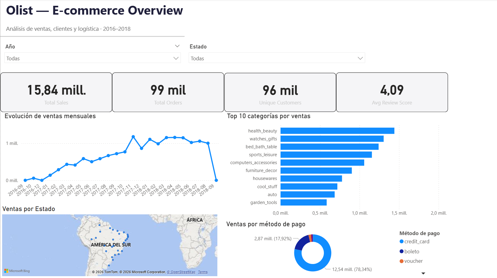
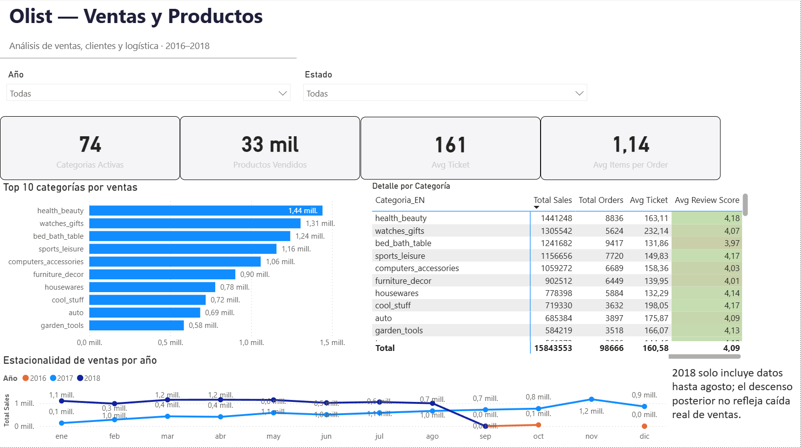
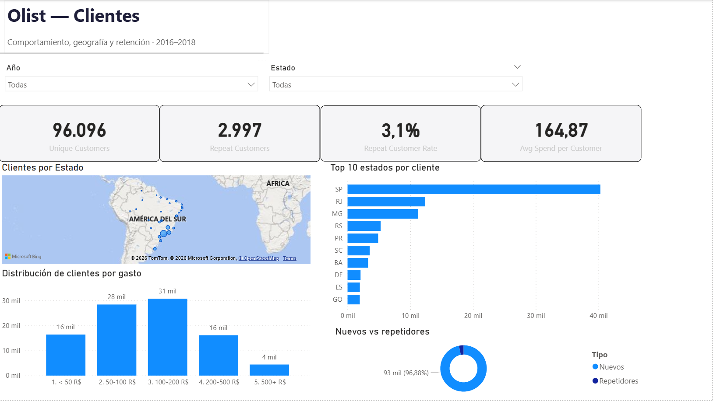
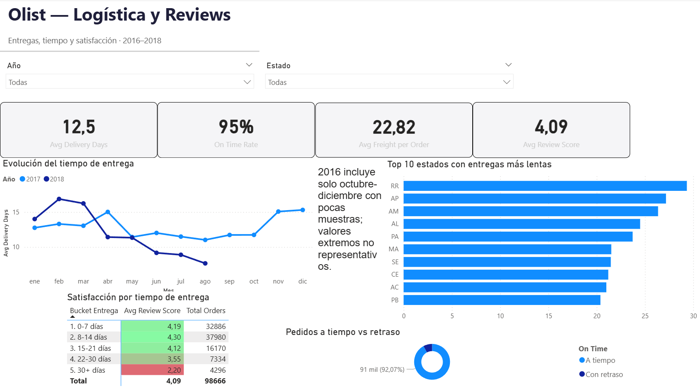

# Olist — Dashboard de E-commerce en Power BI

Dashboard interactivo de 4 páginas sobre el marketplace brasileño **Olist** (99.441 pedidos · 96.096 clientes únicos · 15,84 M R$ facturados entre 2016–2018) construido con **Power BI Desktop**. El objetivo: responder preguntas de negocio reales sobre ventas, clientes y logística, y demostrar modelado dimensional, DAX avanzado y diseño analítico.

**Stack:** Power BI Desktop · Power Query (M) · DAX · Modelo en estrella

---

## TL;DR — Hallazgos clave

1. **Retención crítica:** solo el **3,1% de los clientes** vuelve a comprar. Olist opera como un marketplace de compra única — el principal reto de negocio es la fidelización.
2. **El tiempo de entrega predice la satisfacción:** la matriz por bucket de días revela una caída monótona de la review media desde **4,30 (8-14 días)** hasta **2,20 (30+ días)**. Los retrasos destruyen el NPS.
3. **Desigualdad logística geográfica:** los estados del norte amazónico (RR, AP, AM, PA) tardan 25-30 días de media frente a los 10-12 del sureste. Oportunidad clara de optimización regional.
4. **São Paulo domina** el mercado con ~42% de los clientes; 95% de los pedidos llegan a tiempo, pero ese 5% que no llega concentra la mayor parte de las malas reseñas.

---

## Páginas del dashboard

### 1. Overview

KPIs globales, evolución mensual de ventas, mapa geográfico de facturación, donut de métodos de pago y top categorías.



### 2. Ventas y Productos

Top 10 categorías por facturación (en inglés vía LOOKUPVALUE sobre tabla de traducción), matriz de detalle con formato condicional sobre Avg Review Score, estacionalidad multi-anual con anotación sobre datos parciales de 2018.



### 3. Clientes

4 KPIs de comportamiento (clientes únicos, repetidores, tasa de retención, gasto medio), mapa de clientes por estado, top 10 estados por volumen, donut nuevos vs repetidores y **histograma de segmentación de gasto** por buckets dinámicos (< 50 / 50-100 / 100-200 / 200-500 / 500+ R$).



### 4. Logística y Reviews

Evolución mensual del tiempo de entrega por año, top 10 estados más lentos, donut de puntualidad y **el visual estrella**: matriz de buckets de entrega cruzada con Avg Review Score que cuantifica la relación logística → satisfacción.



---

## Dataset

- **Fuente:** [Brazilian E-Commerce Public Dataset by Olist](https://www.kaggle.com/datasets/olistbr/brazilian-ecommerce) (Kaggle)
- **Licencia:** [CC BY-NC-SA 4.0](https://creativecommons.org/licenses/by-nc-sa/4.0/)
- **Período:** septiembre 2016 – agosto 2018
- **Tamaño:** 9 tablas CSV, ~700k filas totales, 99.441 pedidos únicos
- **Estructura:** datos reales de un marketplace brasileño (anonimizados)

> Contains information from the Brazilian E-Commerce Public Dataset published by Olist and André Sionek, licensed under Creative Commons Attribution-NonCommercial-ShareAlike 4.0 International.

Los archivos CSV **no están incluidos** en este repositorio. Para reproducir el análisis, descárgalos desde Kaggle y colócalos en la carpeta `data/`.

---

## Modelo de datos

Diseño en **star schema** con Order_Items como fact table central y 7 dimensiones conectadas (Orders, Products, Customers, Sellers, Payments, Reviews, Geolocation) más tablas de soporte (Calendar, _Measures, SegmentosGasto, TipoCliente, Category_Translation).

Todas las relaciones son 1:* con **dirección de filtro única** (de dimensión a hechos), excepto CROSSFILTER puntual activado por medida para resolver filtros transversales complejos (Products → Orders → Reviews).

---

## Medidas DAX destacadas

### Ventas y operaciones

```DAX
Total Sales = SUM(Order_Items[price]) + SUM(Order_Items[freight_value])
Total Orders = DISTINCTCOUNT(Order_Items[order_id])
Avg Ticket = DIVIDE([Total Sales], [Total Orders])
Freight % = DIVIDE([Freight Cost], [Total Sales])
```

### Retención de clientes

```DAX
Unique Customers = DISTINCTCOUNT(Customers[customer_unique_id])

Repeat Customers = 
VAR ClientesConVariosPedidos =
    FILTER(
        VALUES(Customers[customer_unique_id]),
        CALCULATE(DISTINCTCOUNT(Orders[order_id])) > 1
    )
RETURN COUNTROWS(ClientesConVariosPedidos)

Repeat Customer Rate = DIVIDE([Repeat Customers], [Unique Customers])
```

### Logística

```DAX
Avg Delivery Days = AVERAGE(Orders[Delivery Days])

On Time Rate = 
DIVIDE(
    CALCULATE(COUNTROWS(Orders), Orders[On Time] = "A tiempo"),
    CALCULATE(COUNTROWS(Orders), NOT(ISBLANK(Orders[Delivery Days])))
)
```

### Segmentación dinámica de gasto (histograma Página 3)

```DAX
Clientes en Segmento = 
VAR MinGasto = SELECTEDVALUE(SegmentosGasto[Min])
VAR MaxGasto = SELECTEDVALUE(SegmentosGasto[Max])
RETURN
CALCULATE(
    COUNTROWS(
        FILTER(
            VALUES(Customers[customer_unique_id]),
            VAR Gasto = CALCULATE(SUM(Order_Items[price]) + SUM(Order_Items[freight_value]))
            RETURN Gasto >= MinGasto && Gasto < MaxGasto
        )
    )
)
```

### Propagación de filtros transversal (matriz Reviews × Categoría)

```DAX
Avg Review Score = 
CALCULATE(
    AVERAGE(Reviews[review_score]),
    CROSSFILTER(Order_Items[order_id], Orders[order_id], Both)
)
```

---

## Retos técnicos resueltos

- **Locale mismatch en Power Query:** el importador español interpretaba los decimales de precio (29.99) como separador de miles (2999), inflando Total Sales a 1,58 mil M. Solucionado eliminando el paso "Changed Type" automático y aplicando "Change Type Using Locale → English (United States)".
- **Ambigüedad geográfica en el mapa:** el código brasileño `PA` (Pará) geocodificaba como Pennsylvania. Solucionado con una columna calculada que mapea los 27 códigos de 2 letras a sus nombres completos y concatena ", Brasil".
- **Filtros que no propagan hacia arriba del star schema:** varios valores salían constantes por categoría (Total Orders, Avg Review Score). Resuelto cambiando la tabla de origen de la medida o usando `CROSSFILTER(..., Both)` puntualmente dentro de CALCULATE.
- **Quirk de `customer_id` vs `customer_unique_id` en Olist:** el primero se regenera en cada pedido; el segundo es el identificador real de persona. Todas las métricas de retención usan `customer_unique_id`.

---

## Limitaciones

- Los datos terminan en agosto 2018, por lo que la aparente caída de 2018 en estacionalidad no refleja comportamiento real sino fin del dataset.
- `review_score` es autodeclarado por el cliente y puede tener sesgo por disponibilidad (clientes insatisfechos más proclives a puntuar).
- Los datos están anonimizados por Olist; no se pueden enriquecer con información externa de los clientes o vendedores.
- El análisis es descriptivo; no se establecen relaciones causales sin un diseño experimental.

---

## Próximos pasos

- **Modelo predictivo de review score** basado en tiempo de entrega, estado, categoría y método de pago (regresión ordinal).
- **Análisis RFM** (Recency, Frequency, Monetary) para segmentar los 96k clientes y diseñar estrategias de fidelización diferenciadas.
- **Cálculo de CLV (Customer Lifetime Value)** proyectado para el 3% de clientes premium.
- **Publicación en Power BI Service** con refresco automático y distribución por email a stakeholders.

---

## Reproducibilidad

```bash
git clone https://github.com/alejandrogonzalezmillan/olist-sales-dashboard.git
cd olist-sales-dashboard
# Descargar los 9 CSVs de Kaggle y colocarlos en data/
# Abrir olist-dashboard.pbix con Power BI Desktop
```

Para abrir el archivo `.pbix` necesitas **Power BI Desktop** (gratuito en Windows). Alternativamente, revisa `olist-dashboard.pdf` para ver el dashboard exportado estáticamente.

---

## Licencia y atribuciones

### Datos

Los datos analizados proceden del **Brazilian E-Commerce Public Dataset by Olist** publicado por [Olist](https://olist.com/) y André Sionek en Kaggle, bajo **Creative Commons Attribution-NonCommercial-ShareAlike 4.0 International (CC BY-NC-SA 4.0)**.

> Contains information from the Brazilian E-Commerce Public Dataset made available by Olist under the [CC BY-NC-SA 4.0](https://creativecommons.org/licenses/by-nc-sa/4.0/) license.

Este repositorio **no redistribuye el dataset original**. Los usuarios deben descargarlo desde Kaggle bajo los términos de la licencia.

### Dashboard y documentación

Al contener análisis derivado de datos CC BY-NC-SA 4.0, **este dashboard y su documentación se publican también bajo CC BY-NC-SA 4.0** por herencia de licencia. Uso no comercial permitido con atribución.

---

## Autor

**Alejandro González Millán**
Graduado en Economía (UGR) · Máster en Modelización y Análisis de Datos Económicos (UCLM)
[LinkedIn](https://linkedin.com/in/alejandrogonzalezmillan) · [GitHub](https://github.com/alejandrogonzalezmillan)